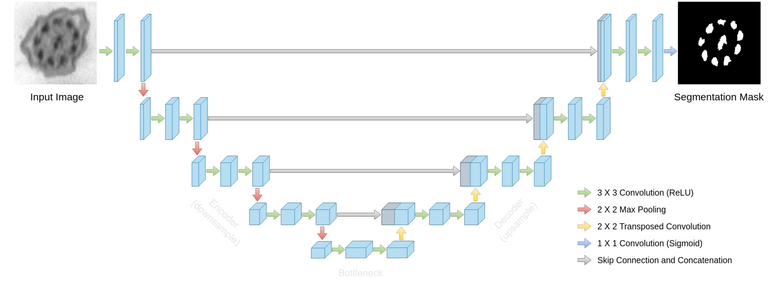

# Segmenting cilia tubules with U-Net 

Train and evaluate a U-Net architecture model on a dataset of [cilia](https://en.wikipedia.org/wiki/Cilium) images and their corresponding ground truth segmentation masks. Evaluate the model and visualize results.



To see an interactive feature visualization of this project check also [this demo](https://simonsmida.github.io/unet-demo/).

## Get Started

1. Download the dataset and make sure to have this directory structure:
   ```
   data/
    ├── images/
    │   ├── img_001.png
    │   ├── img_002.png
    │   └── ...
    └── masks/
        ├── img_001_mask.png
        ├── img_002_mask.png
        └── ...
    ```
2. Install the required dependencies via `uv pip install -r requirements.txt`.
3. Create a virtual environment and activate it: `uv venv venv && venv/Scripts/activate`
4. Run the `python main.py` to get started
